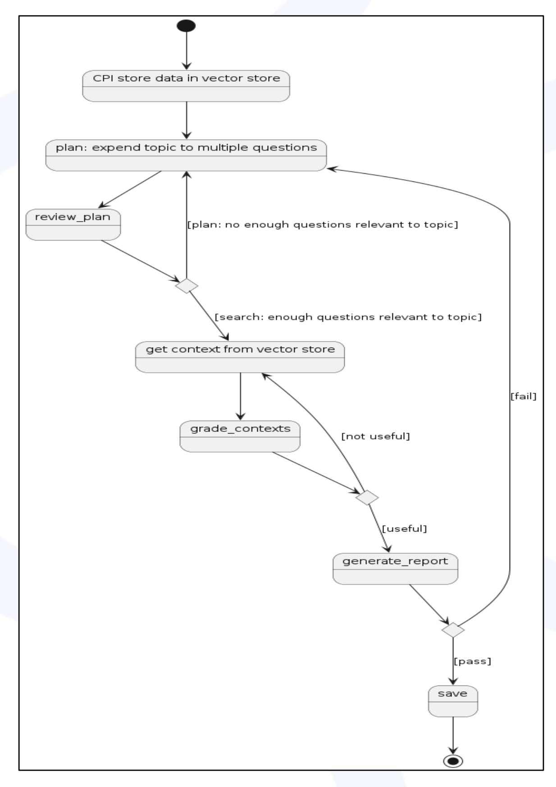

# 📚 RAG for Unstructured Data

## 🧠 Project Overview
**RAG for Unstructured Data** is a Retrieval-Augmented Generation (RAG) system tailored to handle unstructured data (e.g., PDF, Excel, HTML). By combining powerful retrieval mechanisms with large language models (LLMs), this project enables accurate, context-aware responses and document understanding at scale.

---

## 🚀 Features
- 🔍 **Semantic Search & Retrieval**: Efficiently retrieve relevant information from unstructured sources.
- 🤖 **LLM Integration**: Enhance retrieved context using generative AI (e.g., Hugging Face-hosted models).
- 📁 **Document Loader Pipeline**: Automatically extract unstructured elements from Excel, PDF, HTML.
- 🧱 **Embeddings & Vector Store**: Uses sentence transformer embeddings to encode documents into a vector database.
- 📊 **Evaluation Framework**: Generate test sets and compute retrieval metrics (context recall, retriever score).
- 🕸️ **LangGraph Integration**: Agent graph to streamline query handling and response generation.
- 📄 **Response Export**: Output responses in PDF, DOCX, TXT, or HTML format.

---

## 🛠️ Installation

1. **Clone the Repository**
   ```bash
   git clone <repository-url>
   cd RAG-for-Unstructured-Data
   ```

2. **Create a Virtual Environment**
   ```bash
   python -m venv venv
   source venv/bin/activate 
   pip install -r requirements.txt
   ```

3. **Set Up Environment Variables**
   Create a `.env` file under `src/data/`:
   ```ini
   USEREMAIL="your-email"
   PASSWORD="your-password"
   DATA_PATH="/path/to/downloaded/files"
   DOWNLOAD_DATA_PATH="/path/to/unzipped/files"
   JSON_PATH="/path/to/json/files"
   OLLAMA_MODEL="mistral"
   ```

---

## 🧪 Usage Guide

### 1. **Download Data Files**
Use Selenium to log in and download data from the Web URL.
```bash
python src/download_data_selenium.py
```
> ⚠️ You'll be prompted for phone authentication and a pop-up window. Press OK to start the download.

### 2. **Extract Unstructured Elements**
Convert downloaded Excel, HTML, and PDF files into JSON.
```bash
python src/file_loader.py
```

### 3. **Create the Vector Store**
Embed and index the extracted unstructured content.
```bash
python src/data_chat.py
```

### 4. **Run the Interactive Event Listener**
Query the vector store using natural language. Download answers in multiple formats.
```bash
python src/blocks_event_listner.py
```

### 5. **Generate Test Set for Evaluation**
Automatically generate a test dataset based on existing documents. Run the `evaluate.py` script to load the existing vector store and generate test set using the documents. Note: the test set generation takes good of time to run so please be patient.
```bash
python src/evaluate.py
```

### 6. **Evaluate with Metrics**
Run retrieval evaluation using `context_recall` and `context_retriever` metrics. Run the `metrics.py` script to run the retirever based metrics on the above generated "testset.csv". There would be 2 metrics i.e., context_retriever and context precall. Also the code can process only 25 data points at a time.
```bash
python src/metrics.py
```

### 7. **LangGraph Agent Flow**
Run the langgraph using the command:
```bash
python src/langgraph_flow.py
```
Here is the entire complex flow that we have built using LangGraph.

---

## 🤝 Contributing

We welcome contributions from the community!

1. Fork the repository  
2. Create a new feature branch  
   ```bash
   git checkout -b feature/your-feature
   ```
3. Commit your changes  
   ```bash
   git commit -m "Add your feature"
   ```
4. Push and create a pull request  
   ```bash
   git push origin feature/your-feature
   ```

---

## 📄 License
This project is licensed under the **MIT License**. See the [LICENSE](./LICENSE) file for more details.

---

<!-- ## 📬 Contact

For technical support or collaboration inquiries, please reach out to:

**Divya** – [your-email@example.com](mailto:your-email@example.com) -->
